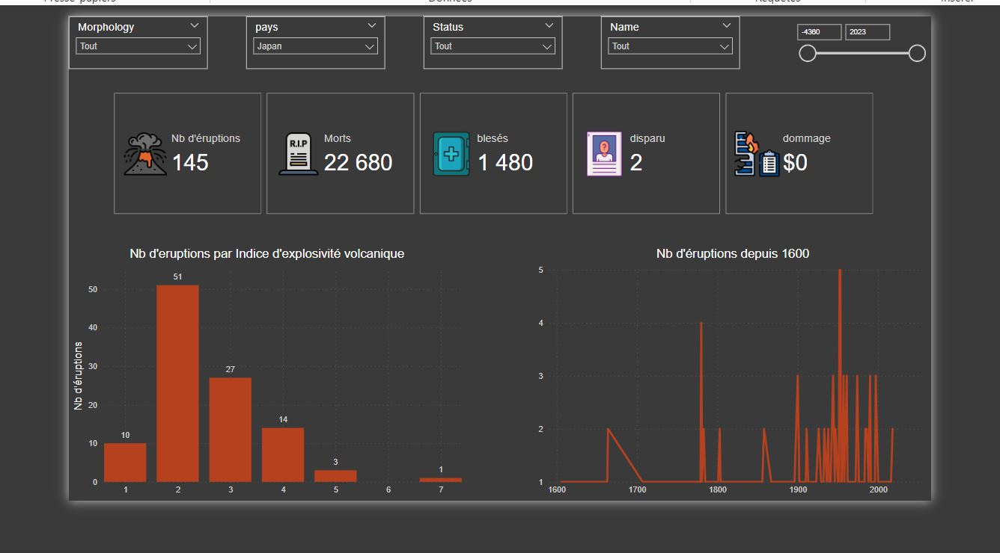

# Projet : Volcano

## Catégorie
**Visualisation**

## Outils utilisés
**Power BI**

## Année
**2023/2024**

## Détail du projet
Ce projet consiste en une analyse des éruptions volcaniques mondiales pour compléter un mémoire de fin d'étude en volcanologie. Les données sont disponibles via la NGDC sous forme de fichiers ou d'API. L'objectif est de créer des indicateurs pertinents (comme le nombre d'éruptions, leur impact humain, etc.) et des visualisations (cartes, graphiques) pour illustrer l'activité volcanique.

### Objectifs du projet
- Créer des indicateurs pertinents tels que :
  - Nombre d'éruptions
  - Impact humain (victimes, déplacements, etc.)
  - Durée et intensité des éruptions
- Fournir des visualisations informatives telles que :
  - Cartes des éruptions volcaniques
  - Graphiques montrant les tendances et les impacts

## Captures d'écran :  

